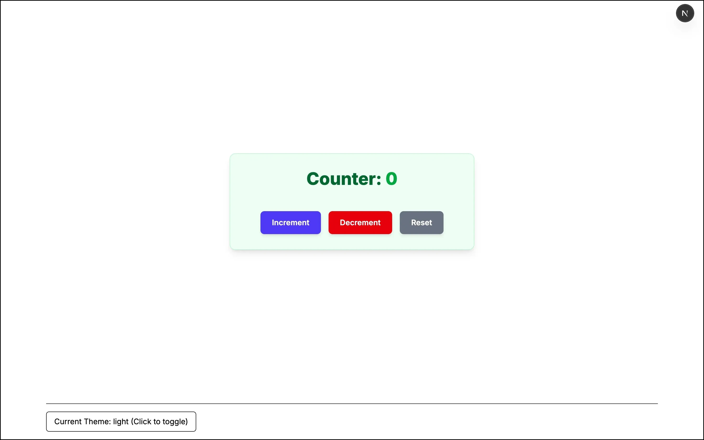
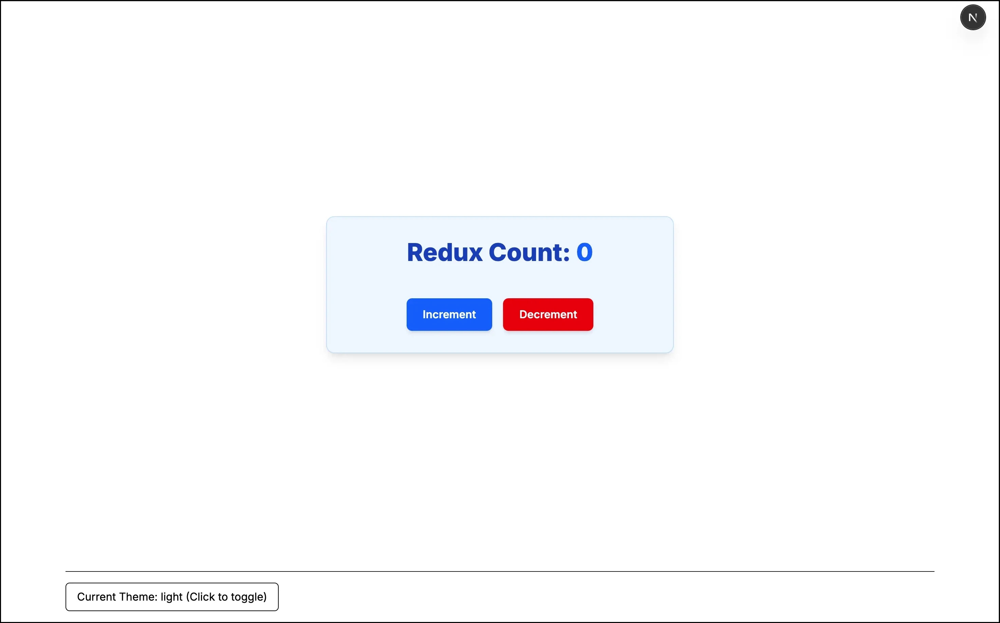
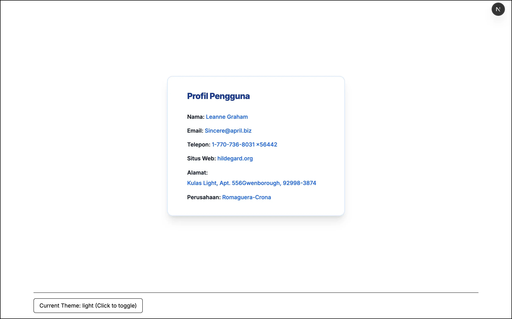
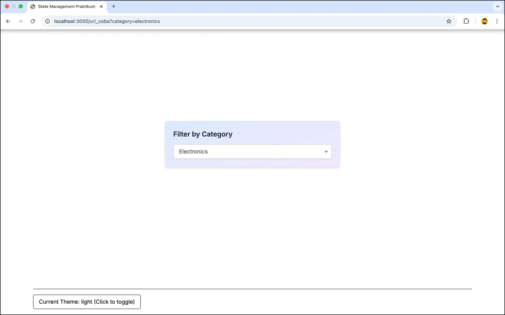
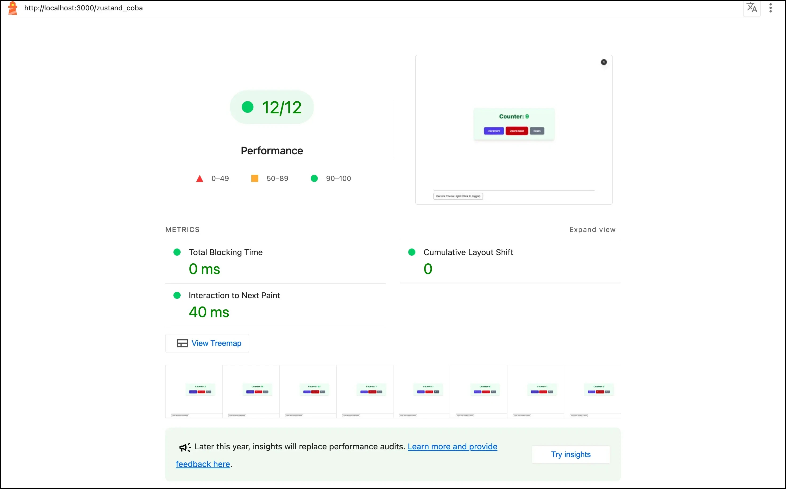

# Laporan Praktikum

|  | Pemrograman Berbasis Framework 2025 |
| ------ |-------------------------------------|
| NIM | 244107027004                        |
| Nama | Rafio Sadani                        |
| Kelas | TI - 4K                             |

## Langkah - Langkah Praktikum

1. Membuat React Context untuk Global State Sederhana
   

2. Membuat State Management Kompleks untuk Counter menggunakan Zustand
   

3. Menggunakan Redux Toolkit untuk Counter dengan SSR Support
   

4. Melakukan Fetching Data User menggunakan SWR (Stale-While-Revalidate)
   

5. Membuat URL State Management untuk Filter Produk berdasarkan Kategori
   

## Tugas Praktikum
1. Perbandingan performa antara Context API, Zustand, dan Redux:

   | State Management | Bukti Performa |
   |------------------|----------------|
   | Context API (Uji Performa Global State untuk Tema) |  |
   | Zustand (Uji Performa Counter menggunakan Zustand) |  |
   | Redux (Uji Performa Conter menggunakan Redux)      | |
   
    <b>Kesimpulan: </b> Dalam pengujian performa Lighthouse, Zustand dan Redux tampil lebih efisien dengan 40ms waktu render, mengungguli Context API yang mencatat 50ms. Ini menunjukkan keunggulan Zustand dan Redux dalam manajemen re-render. Zustand, dengan efisiensi re-render selektif dan API ringkas, ideal untuk sebagian besar aplikasi modern. Redux tetap pilihan kuat untuk aplikasi besar yang kompleks berkat ekosistem tooling lengkapnya. Sementara itu, Context API, karena kecenderungan re-render berlebihan, lebih cocok untuk state global yang jarang berubah seperti tema atau autentikasi.

2. Kapan sebaiknya menggunakan masing-masing solusi?
   - **Context API**
      - Gunakan ketika kita ingin membuat sebuah *global state* sederhana dan jarang berubah.
      - 📍 **Contoh penggunaan**:
         - State untuk tema aplikasi (terang/gelap).
         - State untuk preferensi bahasa.
      - Cocok karena perubahan ini jarang terjadi dan tidak menyebabkan re-render berlebihan di seluruh aplikasi.

   - **Zustand**
      - Gunakan ketika membutuhkan state management yang efisien dengan struktur kode sederhana, tanpa banyak boilerplate.
      - 📍 **Contoh penggunaan**:
         - Dashboard admin dinamis.
         - Banyak widget/kartu dengan data real-time yang sering diperbarui, namun re-render hanya terjadi di bagian yang relevan.
      - Cocok untuk aplikasi real-time dengan skala menengah.
   - **Redux**
     - Gunakan ketika membangun aplikasi berskala besar dan kompleks.
     - 📍 **Contoh penggunaan**:
        - Aplikasi E-commerce (keranjang belanja, filter produk, manajemen pesanan, user profile).
        - Aplikasi ERP (modul inventaris, keuangan, SDM).
     - Cocok karena Redux menyediakan tooling dan arsitektur yang kuat untuk mengelola banyak state yang saling berinteraksi.